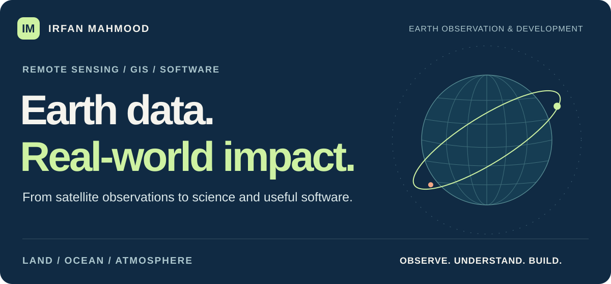
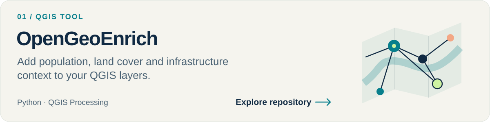
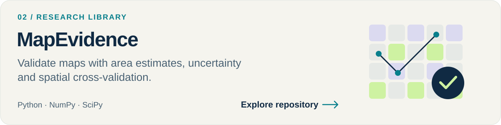
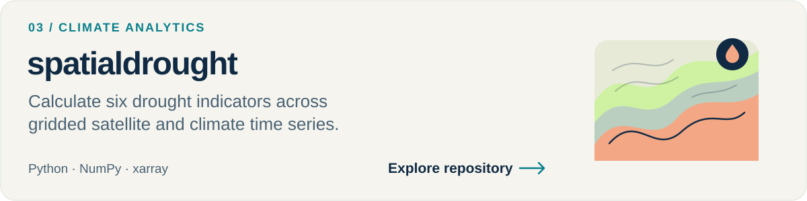
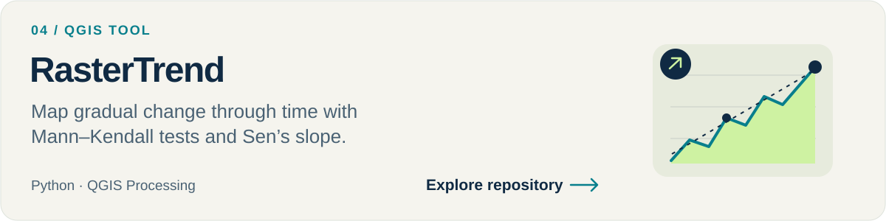
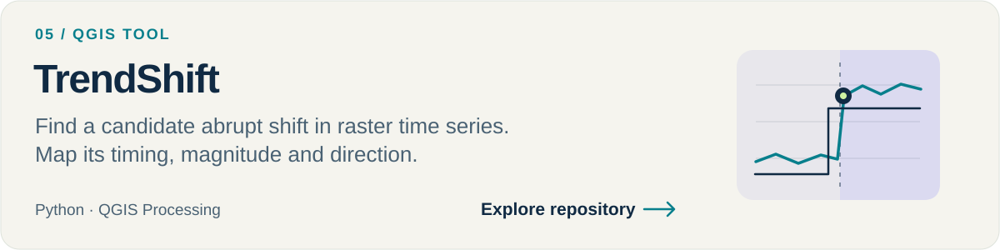
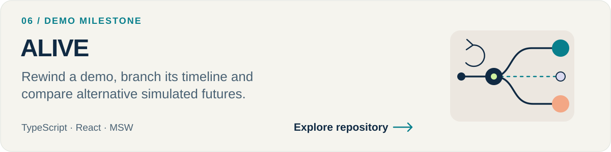

<picture>
  <source media="(max-width: 1011px)" srcset="assets/profile-v2/hero-mobile.svg">
  
</picture>

  <a href="https://mahmoodirfan.github.io/mahmoodirfan/"><strong>PORTFOLIO ↗</strong></a> &nbsp; / &nbsp;
  <a href="#selected-work"><strong>PROJECTS ↓</strong></a> &nbsp; / &nbsp;
  <a href="https://scholar.google.com/citations?hl=en&amp;user=h8RBIjQAAAAJ"><strong>RESEARCH ↗</strong></a> &nbsp; / &nbsp;
  <a href="mailto:irfan.koreshe@gmail.com"><strong>CONTACT ↗</strong></a>

### A geospatial specialist who builds.

I’m **Irfan Mahmood**, a Remote Sensing & GIS Specialist working across **Earth observation, climate, natural hazards, agriculture and marine environments**. I connect satellite time series and field observations with reproducible analysis, open geospatial tools and useful software.

**Research → analysis → working tools.** Python packages, QGIS plugins, Earth Engine workflows and web applications.

 

## Selected work

Open tools for understanding change, adding spatial context and making analytical results easier to use. Select a project to explore its code, examples and documentation.

<a href="https://github.com/mahmoodirfan/OpenGeoEnrich">
  <picture>
    <source media="(max-width: 1011px)" srcset="assets/profile-v2/opengeoenrich-mobile.svg">
    
  </picture>
</a>

<a href="https://github.com/mahmoodirfan/mapevidence">
  <picture>
    <source media="(max-width: 1011px)" srcset="assets/profile-v2/mapevidence-mobile.svg">
    
  </picture>
</a>

<a href="https://github.com/mahmoodirfan/spatialdrought">
  <picture>
    <source media="(max-width: 1011px)" srcset="assets/profile-v2/spatialdrought-mobile.svg">
    
  </picture>
</a>

<a href="https://github.com/mahmoodirfan/RasterTrend">
  <picture>
    <source media="(max-width: 1011px)" srcset="assets/profile-v2/rastertrend-mobile.svg">
    
  </picture>
</a>

<a href="https://github.com/mahmoodirfan/TrendShift">
  <picture>
    <source media="(max-width: 1011px)" srcset="assets/profile-v2/trendshift-mobile.svg">
    
  </picture>
</a>

<a href="https://github.com/mahmoodirfan/ALIVE">
  <picture>
    <source media="(max-width: 1011px)" srcset="assets/profile-v2/alive-mobile.svg">
    
  </picture>
</a>

Each repository documents its current scope, assumptions and limitations. Panel graphics are illustrations, not analytical results.

**[Browse all public repositories ↗](https://github.com/mahmoodirfan?tab=repositories)**

 

## Across disciplines

**Climate & ecosystems** · Drought, vegetation condition, forest and rangeland change, marine heatwaves and coastal monitoring.

**Hazards & Earth processes** · Flood mapping, SAR, InSAR, surface deformation and environmental change.

**Agriculture & water** · Crop classification, seasonal time series, irrigation and weather index insurance.

**Geospatial development** · Reusable Python libraries, QGIS Processing tools, cloud analysis and web interfaces.

### My working toolkit

**Analysis** &nbsp; Python · R · Google Earth Engine · NumPy · SciPy · xarray 
**Spatial** &nbsp; QGIS / PyQGIS · ArcGIS Pro · GDAL · Rasterio · GeoPandas 
**Interfaces** &nbsp; JavaScript · TypeScript · React · Leaflet 
**Observations** &nbsp; Optical imagery · SAR · Gridded climate data · Field observations

 

## Beyond the tools

### AirVista · Environmental data on the web

A web interface for exploring environmental information. **[Open AirVista ↗](https://airvista.netlify.app/)**

### Oceans, landscapes & a changing climate

Explore my [sea surface temperature workflows](https://github.com/mahmoodirfan/Sea-Surface-Temperature), [land-cover mapping](https://github.com/mahmoodirfan/Land-Cover), [terrain visualization](https://github.com/mahmoodirfan/Terrain-Visualization) and [Arctic sea-ice visualizer](https://github.com/mahmoodirfan/Arctic-Sea-Ice-Visualizer).

My research interests include the **Red Sea, marine climate and coral ecosystems**, alongside practical methods for reproducible environmental analysis.

**[Publications on Google Scholar ↗](https://scholar.google.com/citations?hl=en&user=h8RBIjQAAAAJ)** &nbsp; · &nbsp; **[Writing on Medium ↗](https://medium.com/@irfan.koreshe)**

 

<a href="mailto:irfan.koreshe@gmail.com">
  <picture>
    <source media="(max-width: 1011px)" srcset="assets/profile-v2/contact-mobile.svg">
    
  </picture>
</a>

  <a href="mailto:irfan.koreshe@gmail.com"><strong>Email</strong></a> &nbsp; · &nbsp;
  <a href="https://linkedin.com/in/irfan-mahmood-10b60144"><strong>LinkedIn</strong></a> &nbsp; · &nbsp;
  <a href="https://mahmoodirfan.github.io/mahmoodirfan/"><strong>Full portfolio</strong></a>

Earth observation · Environmental research · Geospatial software

