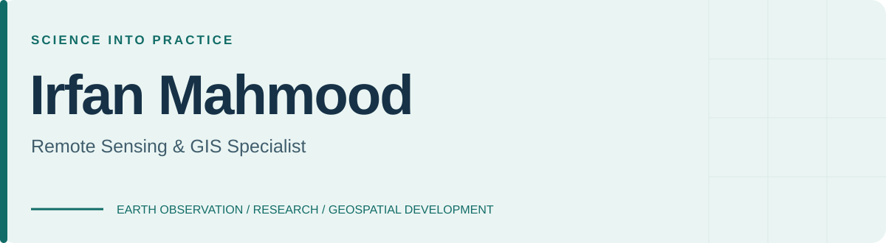
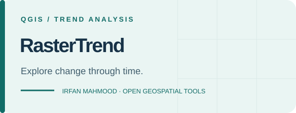
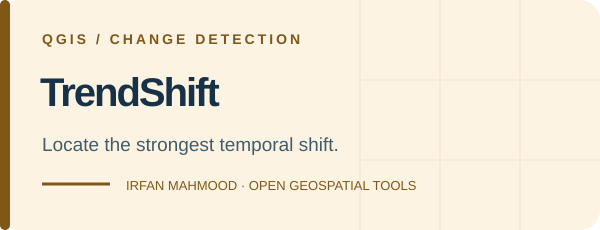
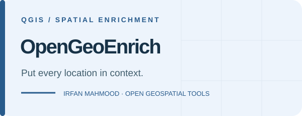
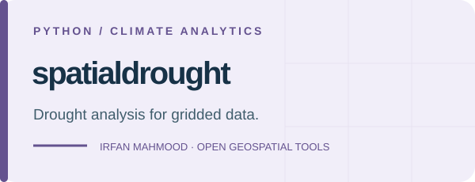

<a href="https://mahmoodirfan.github.io/mahmoodirfan/"><b>Explore my portfolio</b></a> &nbsp; · &nbsp;
<a href="https://linkedin.com/in/irfan-mahmood-10b60144">LinkedIn</a> &nbsp; · &nbsp;
<a href="https://scholar.google.com/citations?hl=en&amp;user=h8RBIjQAAAAJ">Publications</a> &nbsp; · &nbsp;
<a href="mailto:irfan.koreshe@gmail.com">Get in touch</a>

I build geospatial tools and Earth observation workflows for **agriculture, climate risk and environmental monitoring**. My work connects satellite time series, field observations and practical reporting.

---

### Open tools. Practical questions.

<table>
<tr>
<td width="50%" valign="top">

Mann–Kendall tests and Sen’s slope for raster time series.

<a href="https://github.com/mahmoodirfan/RasterTrend#start-here"><b>Explore RasterTrend →</b></a>
</td>
<td width="50%" valign="top">

Pettitt change-point analysis for timing, magnitude and direction.

<a href="https://github.com/mahmoodirfan/TrendShift#start-here"><b>Explore TrendShift →</b></a>
</td>
</tr>
<tr>
<td width="50%" valign="top">

Population, land cover, terrain, roads and facilities for your study area.

<a href="https://github.com/mahmoodirfan/OpenGeoEnrich#start-here"><b>Explore OpenGeoEnrich →</b></a>
</td>
<td width="50%" valign="top">

SPI, SPEI, VCI, TCI, VHI and CDI on gridded datasets.

<a href="https://github.com/mahmoodirfan/spatialdrought#quick-start"><b>Explore spatialdrought →</b></a>
</td>
</tr>
</table>

Read each tool’s guide for input requirements, assumptions and current limitations.

## Where I work

- **Agriculture:** crop mapping, vegetation time series, harvest timing and weather index insurance.
- **Climate and ecosystems:** drought, rangeland condition, marine heatwaves and coastal environmental change.
- **Geospatial development:** QGIS Processing plugins, Python automation and Google Earth Engine workflows.

My core tools are **Python, Google Earth Engine, QGIS, ArcGIS Pro and R**, working with optical, SAR and gridded climate data.

## More projects

- [Sea Surface Temperature](https://github.com/mahmoodirfan/Sea-Surface-Temperature) — satellite-based SST analysis.
- [Land Cover](https://github.com/mahmoodirfan/Land-Cover) — land-cover mapping and visualization.
- [Terrain Visualization](https://github.com/mahmoodirfan/Terrain-Visualization) — terrain visualization workflows.
- [Arctic Sea Ice Visualizer](https://github.com/mahmoodirfan/Arctic-Sea-Ice-Visualizer) — sea-ice visualization.

## Research & collaboration

I am interested in reproducible environmental analysis, useful GIS tools, and the climate of the Red Sea and its coral ecosystems.

Browse my [publications on Google Scholar](https://scholar.google.com/citations?hl=en&user=h8RBIjQAAAAJ) or [articles on Medium](https://medium.com/@irfan.koreshe).

**Using one of my tools?** Open an issue in its repository with your use case, a reproducible problem or a feature request. Small examples and clear feedback help improve the next release.

For research collaboration or geospatial consultancy, [get in touch](mailto:irfan.koreshe@gmail.com).
